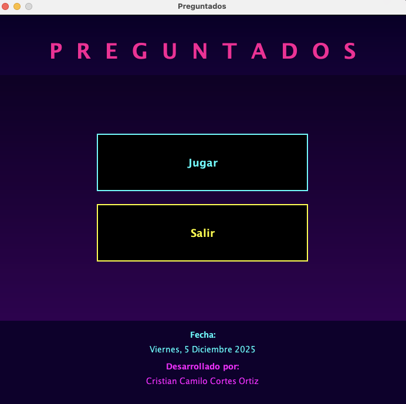
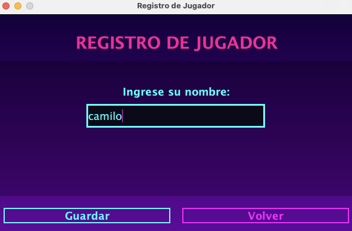
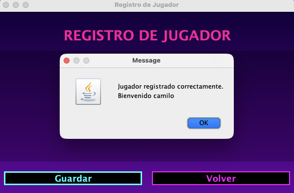
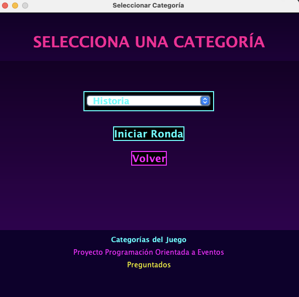
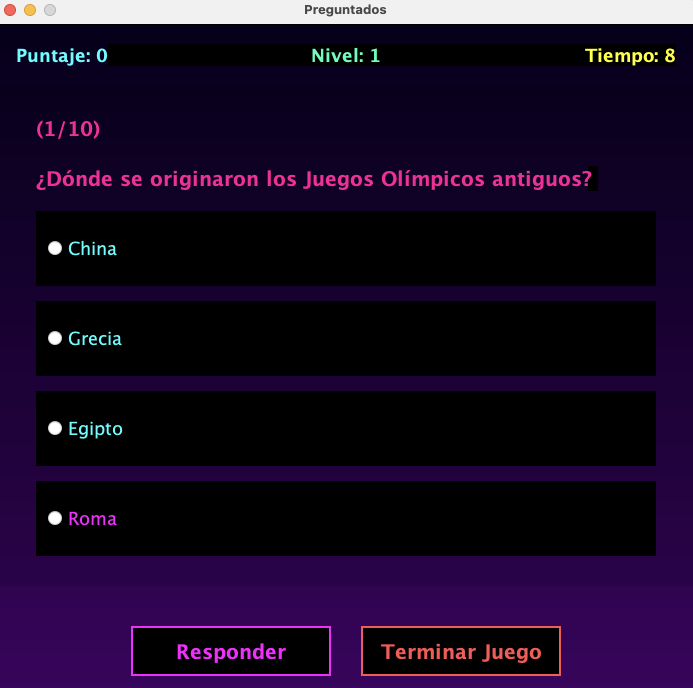
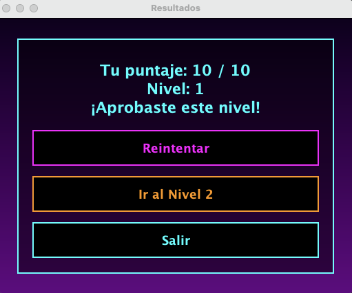
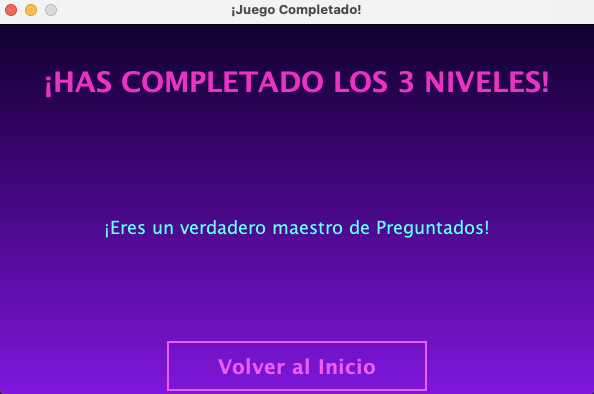

# 🤖 PREGUNTADOS 
### **MiniProyecto 4 – Universidad del Valle**

**Autor:** Cristian Camilo Cortes Ortiz  
**Código:** 202478542  
**Universidad del Valle**  
**Programa:** Tecnología en Desarrollo de Software  
**Asignatura:** Fundamentos de Programación Orientada a Eventos  
**Profesor:** Daniel Esteban Gaviria Clavijo  
**Fecha:** 5 Diciembre 2025

---

## 🧩 Descripción del Proyecto

**Preguntados** es un videojuego educativo de **preguntas y respuestas** ambientado 
en una estética **Cyberpunk**, desarrollado completamente en **Java con Swing** y 
estructurado con el patrón **MVC (Modelo – Vista – Controlador)**.

El jugador atraviesa **tres niveles de dificultad** en diferentes categorías del conocimiento:

- **Historia**  
- **Ciencia**  
- **Cultura General**

Cada nivel presenta un conjunto de preguntas aleatorias, temporizador, retroalimentación 
dinámica y un sistema de puntaje.  
El objetivo es **responder correctamente para avanzar de nivel**, hasta completar 
el **Nivel 3 y ganar el juego**.

---

## 🚀 Características Principales

### 🏁 1. Pantalla de Inicio
- Diseño futurista con neón estilo *Cyberpunk*.  
- Botones:
  - **Jugar**
  - **Salir**

> Si el jugador intenta jugar sin estar registrado, es enviado automáticamente a 
la pantalla de registro.

---

### 🧍 2. Registro de Jugador
- El usuario ingresa un **nombre único**.  
- La aplicación valida que no exista previamente.  
- Después del registro se pasa directamente a la selección de categoría.  
- Estilo visual consistente con paneles semitransparentes tipo *glass UI*.

---

### 📚 3. Selección de Categoría
- El jugador escoge entre:
  - **Historia**
  - **Ciencia**
  - **Cultura**
- La categoría determina el banco de preguntas.  
- Botón para regresar al menú principal.

---

### 🎮 4. Pantalla de Juego (GameView)
Incluye:

- Pregunta mostrada en **área de texto con scroll**.
- **Opciones mezcladas aleatoriamente** para evitar patrones.  
- Temporizador de **15 segundos** por pregunta.  
- Retroalimentación visual de **Correcto / Incorrecto**.  
- Puntaje acumulado.  
- Indicador de **nivel actual**.  
- Botón:
  - **Responder**
  - **Terminar Juego**

> El juego evita el avance si el jugador presiona "Responder" sin elegir una opción.

---

### 🏆 5. Resultados por Nivel
Al finalizar cada nivel:

- Muestra puntaje obtenido.  
- Dice si el jugador **puede avanzar o no** (mínimo 6 aciertos).  
- Botones:
  - **Reintentar Nivel**
  - **Avanzar al Siguiente Nivel**
  - **Salir**

> El botón de siguiente nivel es **dinámico** (Ir al Nivel 2, Ir al Nivel 3).

---

### 👑 6. Pantalla de Victoria Final
Si el jugador completa los **3 niveles**, aparece una pantalla especial con efectos 
visuales celebrando su triunfo:

- Mensaje de "¡HAS GANADO EL JUEGO!"  
- Botón para volver al inicio.  

---

## ⚙️ Tecnologías Utilizadas

- **Lenguaje:** Java 17  
- **Interfaz gráfica:** Java Swing  
- **Patrón de diseño:** MVC  
- **Gestión de puntaje:** Persistencia simple en archivos  
- **IDE recomendado:** IntelliJ IDEA o NetBeans  
- **Estética:** Cyberpunk Neon + Glass UI  

---

## ▶️ Ejecución del Proyecto

1. Clona el repositorio:

```bash
git clone https://github.com/Cristianco9/univalle-java-miniproyecto-4.git
```

2. Abre el proyecto en tu IDE preferido.

3. Compila y ejecuta la clase Main.java o App.java (según estructura final).

4. Comienza el juego!

---

## 📘 Reglas del Juego

---

## 🧠 Progreso por Niveles

| **Nivel** | **Número de Preguntas** | **Dificultad** | **Puntaje mínimo** |
|----------|---------------------------|----------------|---------------------|
| **1**    | 10                        | Fácil          | 6                   |
| **2**    | 10                        | Media          | 6                   |
| **3**    | 10                        | Difícil        | 6                   |

**Si el jugador completa el Nivel 3 → ¡Gana el juego! 🎉**

---

## 🧨 Temporizador

- Cada pregunta tiene **15 segundos**.  
- Si el tiempo se acaba, la respuesta se marca automáticamente como **Incorrecta**.

---

## 🔀 Respuestas Aleatorias

- Las opciones de cada pregunta se **mezclan dinámicamente** para evitar patrones repetitivos.  
- Esto garantiza mayor dificultad y una experiencia más justa.

---

## 💾 Guardado de Datos

- El nombre del jugador y sus puntajes se almacenan mediante el componente **ScoreManager**.  
- Permite llevar un registro persistente de partidas anteriores.

---

## 📑 Informe

Se encuentra en el documento PDF
```sh
documentos/informe.pdf
```

---

## 💻 Autor

**Cristian Camilo Cortes Ortiz**  
📧 *cristian.cortes.ortiz@correounivalle.edu.co*  
👨🏻‍💻 *Desarrollador de Software – Universidad del Valle*

---

## 📸 Capturas de Pantalla

---

> **Pantalla de inicio**



---

> **Registro de usuario**



---

> **Usuario registrado exitosamente**



---

> **Selección de categoria**



---

> **Menu del juego**



---

> **Nivel terminado**



---

> **Juego completado**



---
